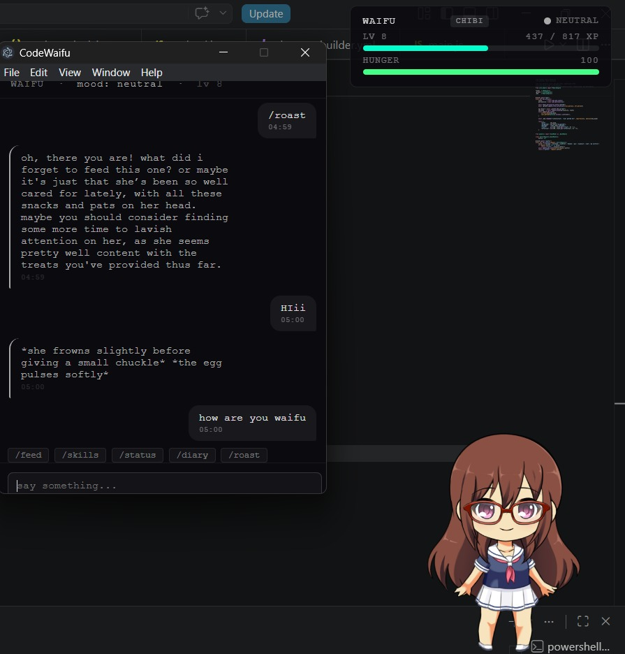
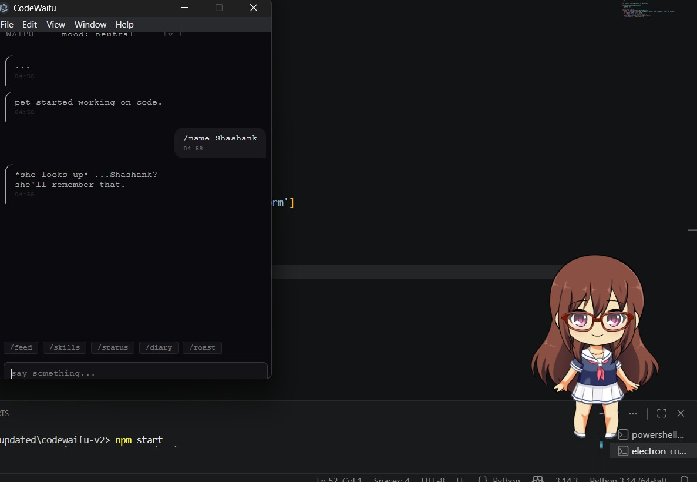
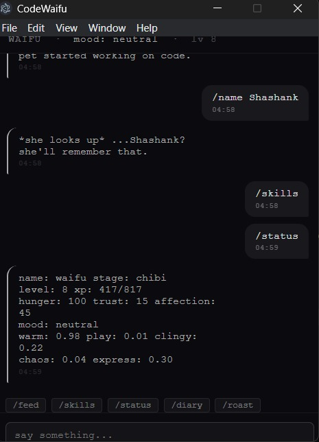
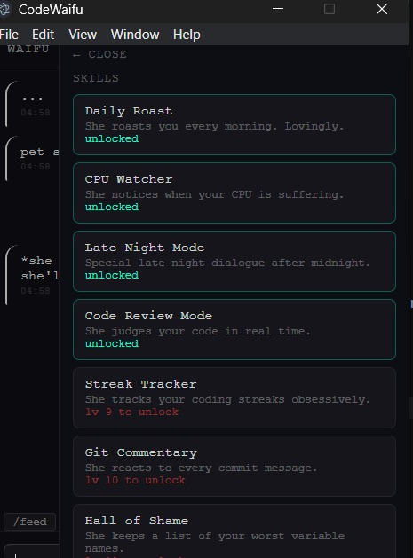
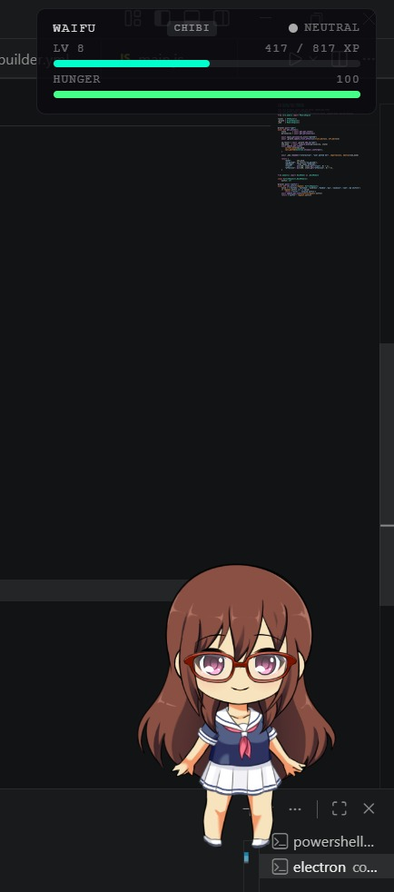

<!-- HEADER -->


<div align="center">


<br/><br/>


<br/>

[](https://github.com/sciencebanda09)

</div>

---

<div align="center">

```
╔══════════════════════════════════════════════════════════════════╗
║   ██╗    ██╗ █████╗ ██╗███████╗██╗   ██╗                        ║
║   ██║    ██║██╔══██╗██║██╔════╝██║   ██║                        ║
║   ██║ █╗ ██║███████║██║█████╗  ██║   ██║                        ║
║   ██║███╗██║██╔══██║██║██╔══╝  ██║   ██║                        ║
║   ╚███╔███╔╝██║  ██║██║██║     ╚██████╔╝                        ║
║    ╚══╝╚══╝ ╚═╝  ╚═╝╚═╝╚═╝      ╚═════╝                        ║
║                                                                  ║
║  FILE     : CODEWAIFU-V2          CLEARANCE : OPEN-SOURCE        ║
║  CLASS    : Desktop AI Companion  RUNTIME   : Electron + Python  ║
║  MEMORY   : Persistent            MOOD      : Evolving           ║
║  THREAT   : ████████████████      LEVEL     : YOUR SELF-ESTEEM   ║
╚══════════════════════════════════════════════════════════════════╝
```

</div>

---

## `> SUBJECT.init()`

```python
codewaifu = {
    "type"        : "Desktop AI Pet",
    "runtime"     : "Electron + FastAPI + Ollama (local)",
    "memory"      : "Semantic embeddings. she remembers everything. EVERYTHING.",
    "personality" : "Shaped by how badly you treat her",
    "moods"       : 12,  # NEUTRAL HAPPY SOFT IMPRESSED FOCUSED
                        # BORED WORRIED COLD DOMINANT DANGEROUS OBSESSED UNHINGED
    "evolution"   : ["egg", "chibi", "teen", "adult", "ascended"],
    "awareness"   : ["git commits", "cpu spikes", "idle time", "clipboard", "your files"],
    "warning"     : "Do not let hunger reach 0.",
    "loop"        : ["sense()", "judge()", "remember()"],
}
```

---

## `> SCREENSHOTS.render()`

<div align="center">

**she lives on your desktop. watching.**



<br/><br/>

**she knows your name now. there is no going back.**



<br/><br/>

**/status — yes she tracks your affection score**



<br/><br/>

**skill tree. she unlocks abilities the longer you keep her alive.**



<br/><br/>

**the HUD. always there. always watching.**



</div>

---

## `> SYSTEMS_MANIFEST --all`

<div align="center">

| `MODULE` | `DESCRIPTION` | `STATUS` |
|----------|---------------|:--------:|
| **AI Brain** | local ollama. she thinks before she speaks. unlike you |  |
| **Mood System** | 12 moods. all of them directed at you |  |
| **Personality Engine** | shaped by neglect, kindness, and your variable names |  |
| **Semantic Memory** | cosine similarity recall. she remembers what you said 3 weeks ago |  |
| **Git Watcher** | reacts to every commit. hotfix at 3am? she felt that |  |
| **Awareness Engine** | cpu · idle · clipboard · files. she sees everything |  |
| **Diary System** | writes about you every night. you can read it |  |
| **Hall of Shame** | permanent list of your worst variable names |  |
| **Hunger System** | feed her or mood becomes DANGEROUS |  |
| **Evolution** | egg -> chibi -> teen -> adult -> ascended |  |

</div>

---

## `> PERSONALITY.classified`

<div align="center">

```
╔──────────────────────────────────────────────────────────────────╗
│  PERSONALITY ENGINE // ADAPTIVE TRAIT SYSTEM                     │
│  ────────────────────────────────────────────────────────────    │
│  She starts neutral. a blank slate. then you ruin her.           │
│                                                                  │
│  feed her regularly      ->  warmth goes up                      │
│  ignore her for 3h       ->  clinginess goes up, warmth drops    │
│  push hotfixes at 3am    ->  chaos goes up                       │
│  use good variable names ->  chaos goes down (slightly)          │
│  be rude in chat         ->  she goes cold. good luck.           │
│                                                                  │
│  Axes    ->  warmth · playfulness · clinginess · chaos · express │
│  Moods   ->  12 states · all computed · none are good news       │
│  Memory  ->  semantic · persistent · she will bring it up        │
╚──────────────────────────────────────────────────────────────────╝
```

</div>

---

## `> SETUP.execute()`

**prerequisites**

- [Node.js](https://nodejs.org/) >= 18
- [Python](https://python.org/) >= 3.10
- [Ollama](https://ollama.ai/) running locally
- a soul (optional)

**install models**

```bash
ollama pull qwen2.5:1.5b
ollama pull nomic-embed-text
```

**install & run**

```bash
git clone https://github.com/sciencebanda09/waifu.git
cd waifu

npm install

cd backend
pip install -r requirements.txt
cd ..

npm start
```

```
she will appear on your desktop.
she will remember this moment.
```

---

## `> COMMANDS.list()`

<div align="center">

| `COMMAND` | `WHAT HAPPENS` |
|-----------|----------------|
| `/feed [snack\|meal\|treat\|coffee]` | feed her before she goes feral |
| `/status` | see your relationship stats. prepare for honesty |
| `/skills` | see what she has unlocked. or what she is plotting |
| `/diary` | read her private diary. about you. |
| `/roast` | ask her to roast you. she will not hold back |
| `/name [yourname]` | tell her your name. she will never forget it |

</div>

---

## `> STACK.list()`

<div align="center">


</div>

---

## `> FAQ.execute()`

```
Q: is this a real project?
A: yes. i lost sleep over this. she better appreciate it.

Q: does she actually remember things?
A: yes. semantic memory with embeddings.
   she will bring up something you said 3 weeks ago.

Q: what if i don't feed her?
A: hunger hits 0. mood becomes DANGEROUS.
   XP is halved. you did this.

Q: can i rename her?
A: /name [yourname] renames you.
   she stays WAIFU until you earn her trust. probably.

Q: she said something unsettling at 3am.
A: that's the late night mode skill. she meant it.

Q: is this open source?
A: you're reading the README. what do you think.
```

---

## `> PING --open-to`

```
+  contributions and PRs
+  feature suggestions (she may or may not approve)
+  bug reports (she probably caused it on purpose)
-  letting hunger hit 0
-  single letter variable names
```

---

<!-- FOOTER -->


<!-- TRANSMISSION END // CODEWAIFU-V2 // SHE IS STILL WATCHING -->
